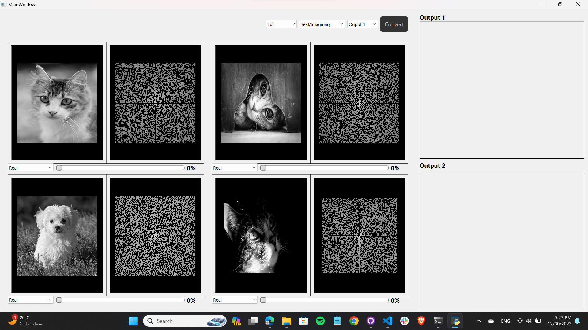
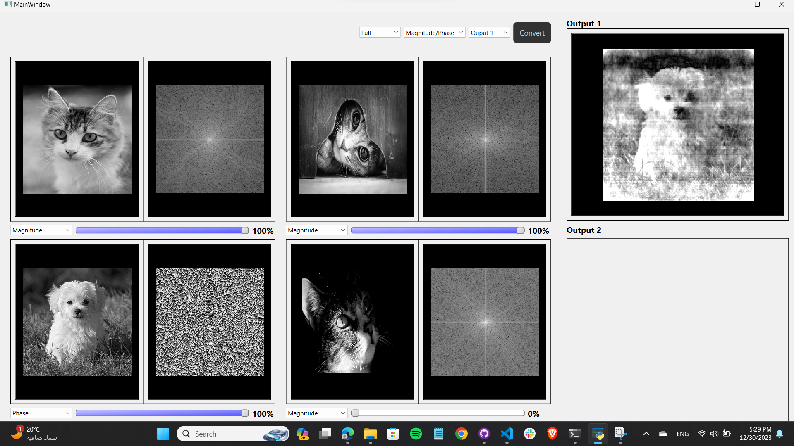
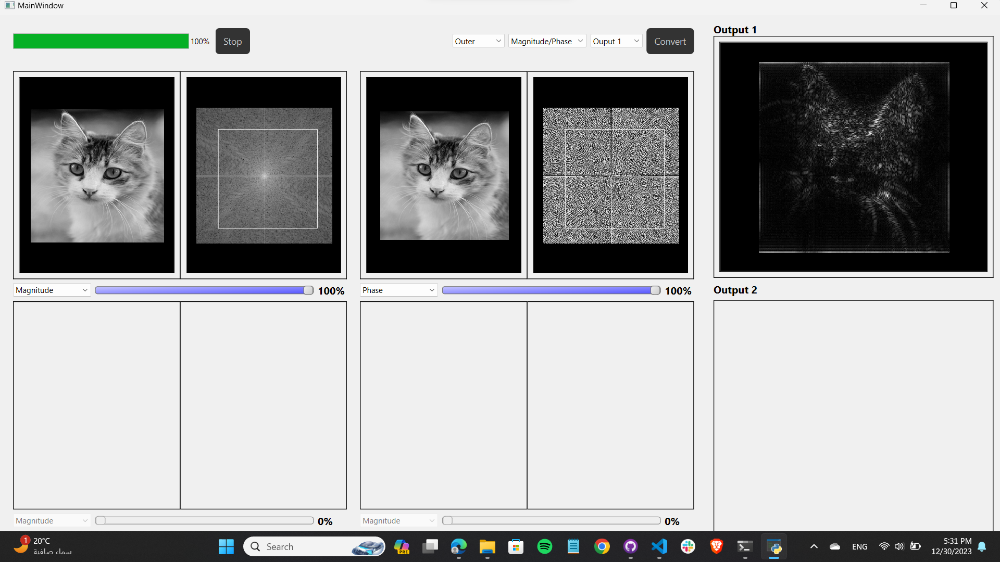

# Sampling Studio

Sampling Studio is a desktop application built with PyQt that enables users to work with biomedical signals. With Sampling Studio, you can open biomedical signal files, visualize them, sample them at a chosen frequency, and even add noise to the signals. Additionally, you can create your own signals using the built-in signal composer by specifying different signal components like amplitude, frequency, and shift.

## Table of Contents

- [Features](#features)
- [Screenshots](#screenshots)
- [Getting Started](#getting-started)
- [Usage](#usage)
- [Contributors](#contributors)

## Features

- **Open 4 Images:** Load Images visualization and processing.

- **Visualize image components:** Visualize the 4 components of each image: Magnitude, Phase, Real, and Imaginary.

- **Real time brightness and contrast control:** Adjust the brightness and contrast to meet your requirements.

- **Image Mixer:** Create a new image by mixing  either phase and magnitude or imaginary and real in an intuitve way.

- **Regions Mixer:** Mask the regions you want to mix with a single click and drag.

## Screenshots



_Loading 4 images._



_Mixing image components._



_Using Regions Mixer._


## Getting Started

### Prerequisites

- Python 3.6 or higher
- PyQt5

### Installation

1. Clone this repository to your local machine.

```bash
git clone https://github.com/yourusername/ImageMixer.git
```

2. Install the required dependencies.

```bash
pip install requirements.txt
```

3. Run the application.

```bash
cd src
python main.py
```

## Usage

1. **Open Images:**

   - Double click the "image port"  to select an image for visualization.

2. **Brightness and Contrast Control:**

   - Scroll your cursor horizontally for contrast control and vertically for brightness control.

3. **Image Mixer:**

   - Choose the mode mag/phase or real/imag.
   - Use sliders to adjust the components percentages.
   - Click "Convert" to start mixing.

4. **Regions Mixer:**

   - Choose the inner or outer mode then use the mouse to select your ROI.

## Contributors

We would like to acknowledge the following individuals for their contributions to the research:

<table>
  <tr>
    <td align="center">
    <a href="https://github.com/Bodykudo" target="_black">
    
    <br />
    <sub><b>Abdallah Magdy</b></sub></a>
    <td align="center">
    <a href="https://github.com/abduelrahmanemad" target="_black">
    
    <br />
    <sub><b>Abdelrahman Emad</b></sub></a>
    </td>
    </td>
    <td align="center">
    <a href="https://github.com/MohamedAlaaAli" target="_black">
    
    <br />
    <sub><b>Mohamed Alaa</b></sub></a>
    </td>
    <td align="center">
   <td align="">
    <a href="https://github.com/Medo072" target="_black">
    
    <br />
    <sub><b>Mohamed Ibrahim</b></sub></a>
    </td>
    </tr>
 </table>

---

Enjoy working with Image Mixing!
